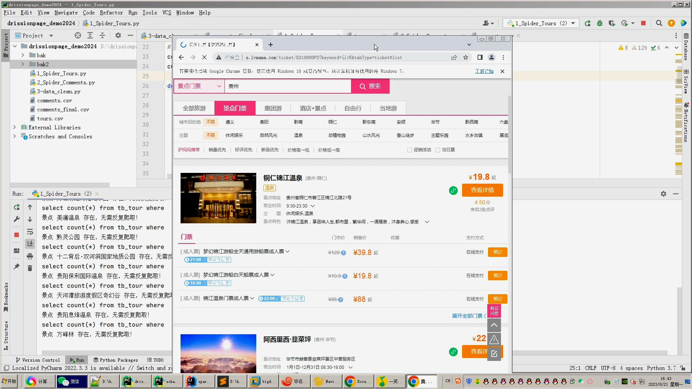

## 计算机毕业设计吊打导师hadoop+spark+hive旅游推荐系统 旅游数据 旅游分析可视化大屏 智慧旅游路线推荐 旅游爬虫 旅游大数据 旅游攻略系统 大数据 大数据毕业设计 机器学习 预测系统 数据仓库 大数据毕业设计 文本分类 LSTM情感分析 大数据毕业设计 知识图谱 大数据毕业设计 预测系统 实时计算 离线计算 数据仓库 人工智能 神经网络

## 要求
### 源码有偿！一套(论文 PPT 源码+sql脚本+教程)

### 
### 加好友前帮忙start一下，并备注github有偿hive旅游数仓+推荐
### 我的QQ号是2827724252或者798059319或者 1679232425或者微信:bysj2023nb

# 

### 加qq好友说明（被部分 网友整得心力交瘁）：
    1.加好友务必按照格式备注
    2.避免浪费各自的时间！
    3.当“客服”不容易，repo 主是体面人，不爆粗，性格好，文明人。

基础版，也就是当前下面连接这个版本(只带hadoop spark hive flask DrissionPage爬虫[全新爬虫框架吊打碾压selenium这些垃圾传统Python爬虫] echarts大屏可视化驾驶舱)

https://www.bilibili.com/video/BV1ap4y1n7hY/?spm_id_from=333.999.0.0

## 开发技术：
spark hadoop hive 装杯显摆虚拟机Linux敲命令炫酷吊打 flask echarts sqoop scala hdfs yarn mysql python爬虫框架等；

## 流程： 

1.DrissionPage自动化爬虫框架采集旅游数据约10万条存入mysql数据库、.csv文件作为数据集(旅游数据、用户数据、评论数据)；

2.使用pandas+numpy或MapReduce对数据进行数据清洗，生成最终的.csv文件并上传到hdfs(含nlp情感分析)；

3.使用hive数仓技术建表建库，导入.csv数据集；

4.离线分析采用hive_sql完成，实时分析利用Spark之Scala完成;

5.统计指标使用sqoop导入mysql数据库；

6.使用flask+echarts进行可视化大屏幕炫酷展示；

## 创新点：
1.全新DrissionPage爬虫框架，性能强悍碾压selenium/requests等常见传统Python爬虫技术；

2.可视化炫酷大屏幕；

3.虚拟机显摆敲命令碾压答辩现场(市面上全是假算法假爬虫假大数据都不带用虚拟机的)；

4.nlp深度学习文本分类情感分析；

5.Spark实时计算+Hive、Hadoop离线计算双实现有效避免导师喷你；

## 可选装项目模块如下：
1.推荐系统(4种深度学习推荐算法 协同过滤基于用户 基于物品 SVD神经网络 MLP)。附带AI、支付、短信、lstm情感分析。
2.预测系统(KNN CNN RNN卷积神经预测 K-means 线性回归)。
3.知识图谱neo4j可视化关系网络图。
4.后台管理系统。

选装视频效果如下：
https://www.bilibili.com/video/BV1pm4y1d7S5/?spm_id_from=333.999.0.0

